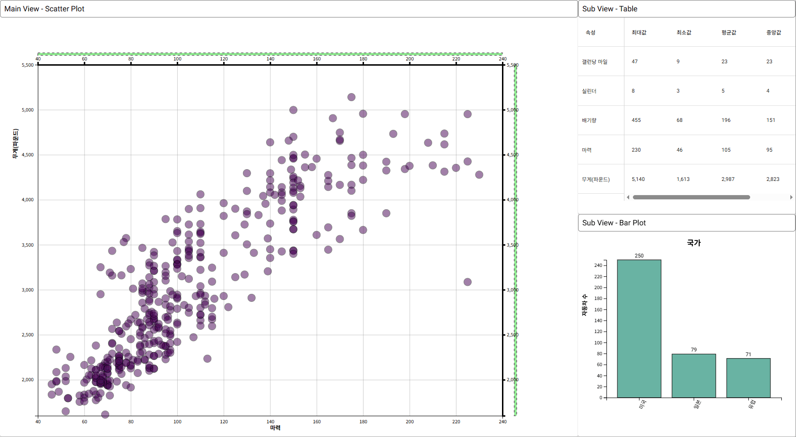

# Contextual Stack Navigator (CSN)

This repository presents the paper (KR):

- **Byungmin Kim**, Kyuhan Kwak, Hoyong Eom, and Hyunjoo Song, ["Contextual Stack Navigator: A Spatially Context-Aware Hierarchical View Management Interface for Supporting Visual Exploration"](https://doi.org/10.23019/kingpc.21.1.202502.007), *Journal of Korean Institute of Next Generation Computing*, 2025

## Overview
The **Contextual Stack Navigator (CSN)** is an advanced navigation aid designed to support **exploratory visual analysis (EVA)**. By storing views generated during the exploration process in a hierarchical structure, CSN offers users clear contextual cues, enhancing the navigation experience. Its flexibility allows CSN to be used across various data analysis scenarios, making it applicable to diverse fields without being constrained by specific data representations.

## Key Features
- **Spatial Context Awareness**: Offers users intuitive visual context throughout the exploration process.
- **Hierarchical View Management**: Organizes views in a stack-like structure to help users backtrack and refine their analysis.
- **Flexible and Intuitive Interaction**: Facilitates smooth and efficient data exploration without requiring domain-specific representations.
  
## Visual Demo
The following demo showcases **Contextual Stack Navigator (CSN)** in action during an exploratory visual analysis (EVA):

  

  <b>Fig. 1. Example of performing exploratory visual analysis (EVA) during the data analysis process.  </b> 

  

   
  
  

  <b>Fig. 2. Demo of the CSN in action. See how CSN supports navigation and data exploration in a real-time scenario.</b> 

## Further Details
For further details, refer to the full paper linked above.
