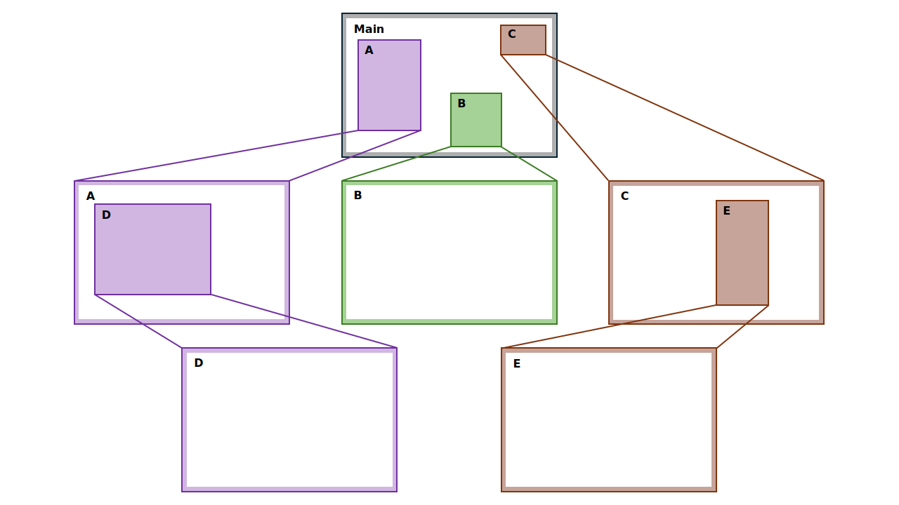
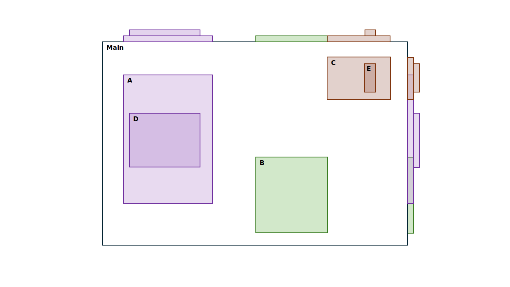

# Contextual-Stack-Navigator

This is an presentation of our paper(KR): 

Byungmin Kim, ...,. [Contextual Stack Navigator: A Spatially Context-Aware Hierarchical View Management Interface for Supporting Visual Exploration](url)

## Summary
Contextual Stack Navigator (CSN), a navigation aid that helps users navigate in exploratory visual analysis(EVA). CSN stores views generated during the exploration process in a hierarchical structure and provides users with clear contextual cues. CSN is not constrained by data representation types, making it applicable to a wide range of data analysis scenarios while supporting intuitive interactions and flexible data exploration.

Example of performing exploratory visual analysis (EVA) during the data analysis process

When performing exploratory visual analysis with Contextual Stack Navigator (CSN)
